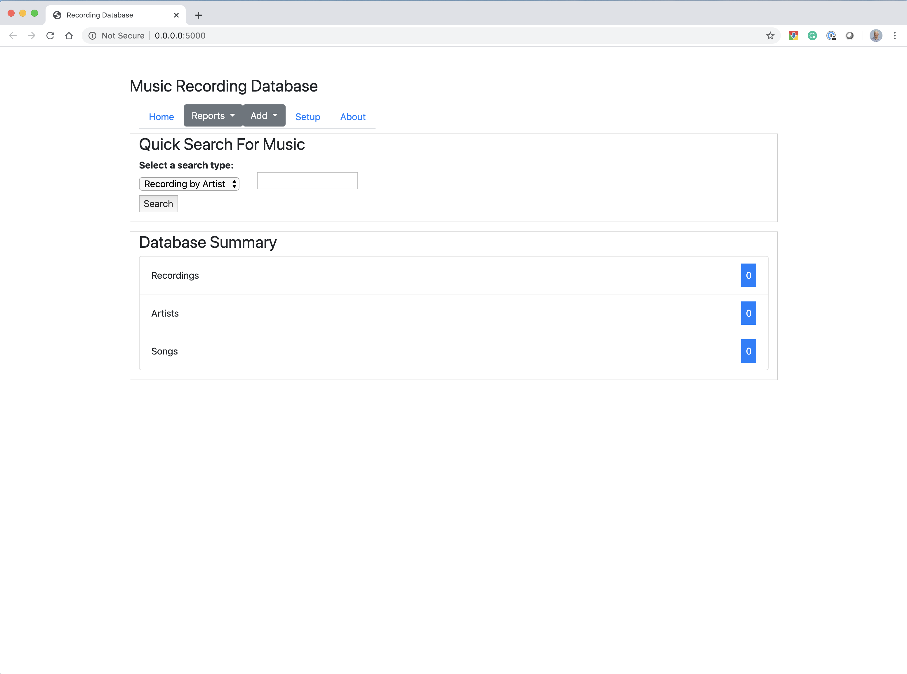
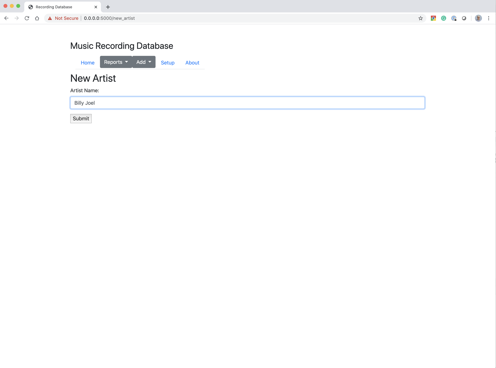
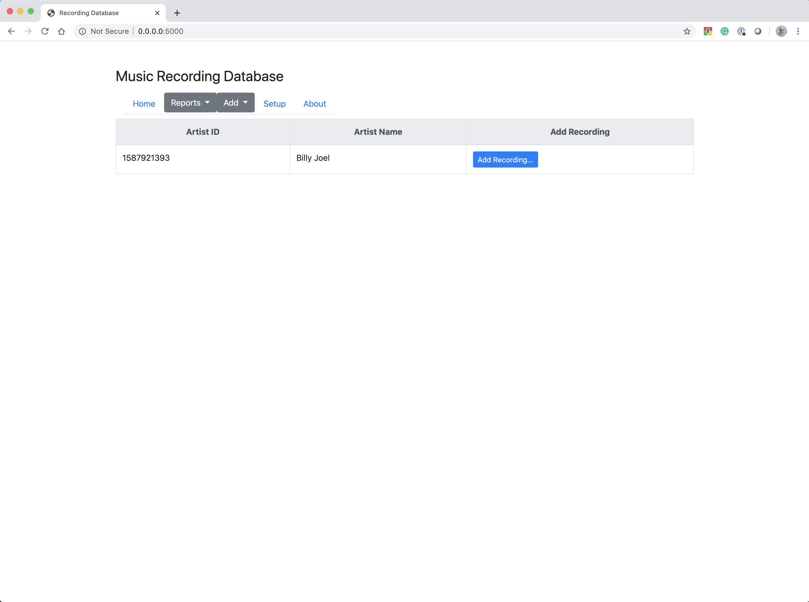
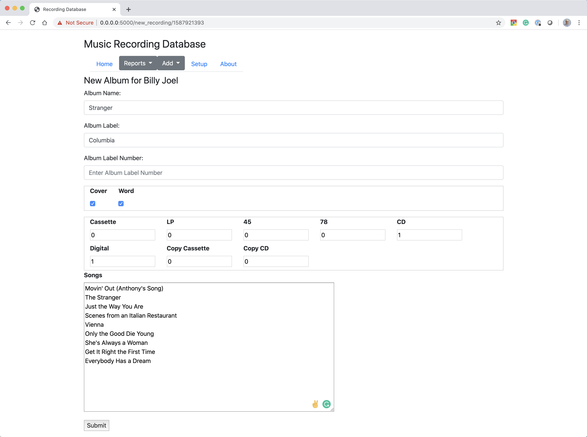
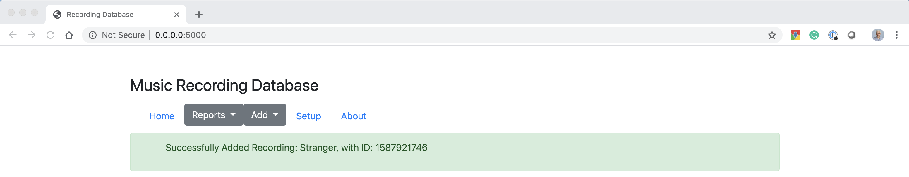
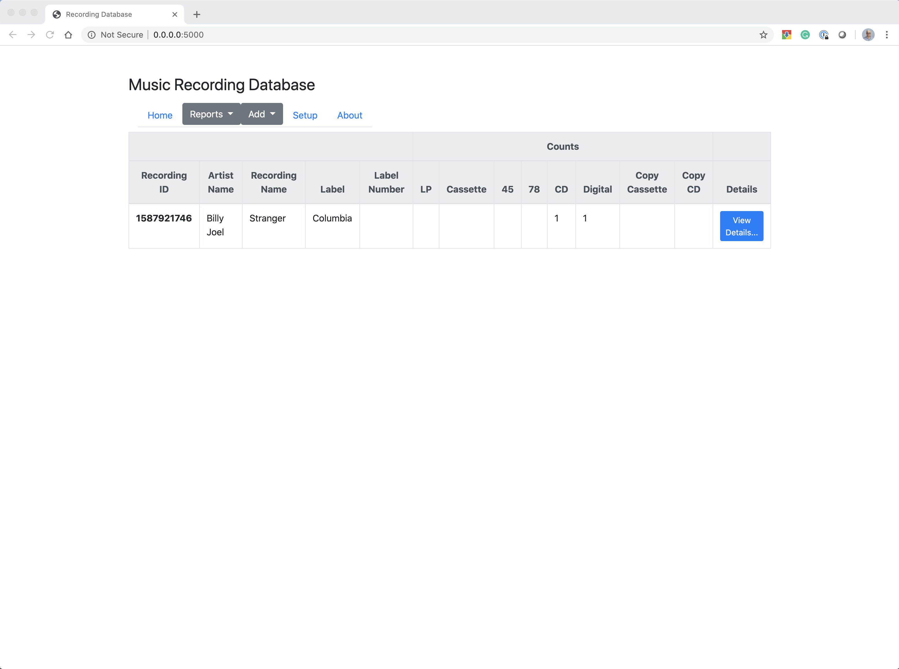
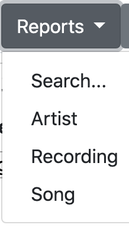
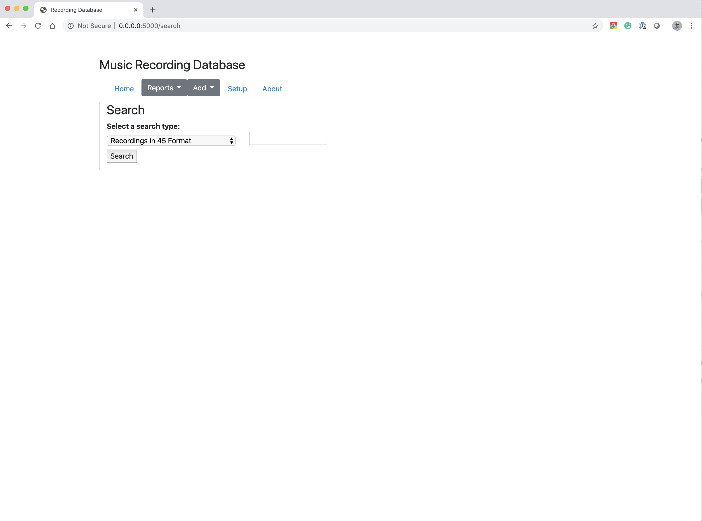

# Music Database

## Description
When I first started with database programming, I created a recording database using Microsoft Access. This application was used for me to store my album collections. In addition to basic database functionality, I had special reports created to help query the database. Unfortunately, this application is starting to get very old especially when Access is not supported on a Mac.    Once I started doing Python programming, I looked at this as an option to convert the Microsoft Access Database over to python.   It also gave me the opportunity to learn a bunch of new libraries and plugins.

Therefore, this application is my first database python application. I would welcome any feedback to the application.

## References
This project was based on a few references that I borrowed code and ideas from.   These references are located below:

https://www.blog.pythonlibrary.org/2017/12/12/flask-101-adding-a-database/

https://blog.miguelgrinberg.com/post/the-flask-mega-tutorial-part-i-hello-world

## Requirements
This application has been written in Python 3.7 and must use Python 3.7.   There are several libraries that aren't compatible with previous versions!

* Flask
* flask-sqlalchemy
* flask-migrate
* wtforms

## Setup

First step is to clone the repository by using the command:

```git clone {gihub repository}```

Create a python3 virtual environment so we can run the new application in and install the requirements:

```buildoutcfg
$ python3 -m venv musicdb-venv
$ source musicdb-venv/bin/activate
(musicdb-venv) $ pip install -r requirements.txt
```

Once the requirements are installed, we have to create the database.   We use the Flask-Migrate application for this.   You can do the following:
```buildoutcfg
(musicdb-venv) $ musicdb chris$ flask db upgrade
INFO  [alembic.runtime.migration] Context impl SQLiteImpl.
INFO  [alembic.runtime.migration] Will assume non-transactional DDL.
INFO  [alembic.runtime.migration] Running upgrade  -> 0cdb2428566d, Initial Database Revision

```

At this point the new database should be installed.   To run the application enter the url into any web browser.   By default, the application will list to all ip address at port 5000.

```buildoutcfg
(musicdb-venv) $ python musicdb.py
 * Serving Flask app "app" (lazy loading)
 * Environment: production
   WARNING: This is a development server. Do not use it in a production deployment.
   Use a production WSGI server instead.
 * Debug mode: off
2020-04-14 16:49:28,505-_log            INFO      * Running on http://0.0.0.0:5000/ (Press CTRL+C to quit)
```
## Database changes
We are using the Flask-Migrate library to help us migrate the database when changes are made.   To start this right now, you can go into the command line and do the following:

```$ flask db upgrade```

Also when changes occur to the database structure, you can create the migration tables:

``` flask db migrate - m "comment"```

This function will create the migration scripts.   Then once the migration scripts are create, you can run:

```$ flask db upgrade```

## User's Guide

### Starting the application
Once the application is running, enter the ip address into a web browser. As mentioned above, the application will bind itself to all ip addresses on the local computer at port 5000. You should be able to enter http://0.0.0.0:5000 into the address bar.   The main title screen should appear:

By default, the main screen will have a menu bar, a quick search function and a database summary of our current database.

### Main Menu

The main menu has 5 main choices:
* **Home** - This menu item will take you back to the main screen
* **Reports** - This menu item will allow you to access the different reports that are built into the system
* **Add** - This menu item will allow you to add a new artist.
* **Setup** - This menu item will provide setup options
* **About** - This menu item will provide the details about the application

### Workflow to add a recording
To begin to add any recording, you first have to add an artist. To do this, select the "Artist" from the Add menu.   You should see the new artist dialog.

You can add any artist name into this screen.  In this example, we are adding a new artist call "Billy Joel".

If the addition, was successful, you should se a message. The application will automatically check for duplicates so you cannot add multiple artists with the same name. In addition, the application will do basic modification of the artist to fix items like improper capitalization or multiple spaces or white space in the name.

Once a artist, was successfuly added, we can add a recording for that artist. First let's search for the artist.  To do this, from the main menu, use the "Quick Search" functionality to search for the artist name:

In this example, let's enter "Billy Joel" and hit the Search button. The artist should appear:

Next to the artist name, there is a button called "Add Recording..." Once we click on that button, it will open up the new recording window:

We can add all the pertinent details to the detail.  The only information that is required is the "Album Name". Everything else is optional. In addition, you can list the songs that appear on the recording. Once you are completed, hit the "Submit" button to save the recording.


### Reports
The application has a variety of reports that can be created. One method is to use the quick search functionality on the main screen.

There are four types of quick searches available:
* **Recording by Artist** - Given an Artist name, return all recordings by that artist.
* **Recording by Album** - Given an Album name, return all recordings with that name
* **Recording by Song** - Given a Song name, return all recordings with that song
* **Artist** - Given an artist, list all the artists in the database with that name

Note the search functionality is searching any combination of what is in the text field.   For example, "Billy" would return all artists who have Billy in the name.  "Polka" would return all the songs that contain the word Polka.

As an example, the following query would return all recordings by "Billy Joel"

The output would then be the following

From this screen, we can hit the "View Details..." button next to the recording. This will allow us to edit the recording.

Another choice to run reports is via the report menu.


From this report there are a few choices. 
* **Search...** - This search window will bring up the search function described below.
* **Artist** - This search will list all artists
* **Recording** - This search will list all recordings
* **Song** - This search will list all songs (Be careful with this one since if you have a large database, it could take a very long time to display)

If you select the "Search..." menu from the Report menu, you will see the following screen.

This screen provides alot of other reports that can be generated.   These include
* **Recordings in 45** - Displays all recordings with a type of 45
* **Recordings in 78** - Displays all recordings with a type of 78
* **Duplicate LPs** - Displays all recordings where we have duplicate copies of an LP format
* **Recordings with 0 copies** - Displays all recordings that we don't have any copies
* **Recordings not yet in Digital Format** - Displays all recordings that we don't have a digital copy
